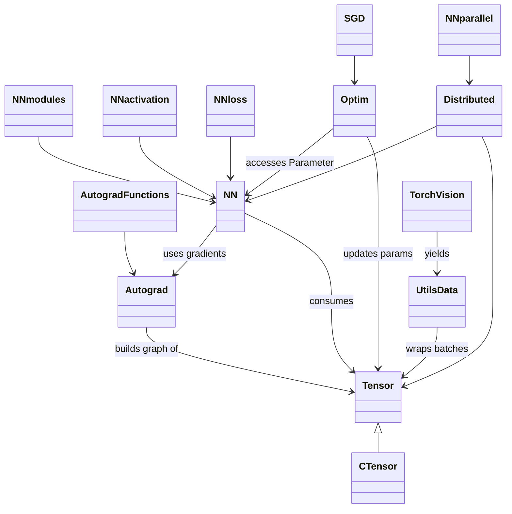

# RStorch

> PyTorch-style tensor library & deep-learning framework written **entirely in Rust** (with a sprinkle of C/CUDA under the hood).
>
> • Autograd  • CUDA & Multi-GPU  • nn Modules  • Optimisers  • Datasets  • torch-style API

---

## 1. Why RStorch?
Rust gives us memory-safety, fearless concurrency and zero-cost abstractions.  RStorch keeps PyTorch’s ergonomics while enjoying Rust’s compile-time guarantees.

* Write models in plain idiomatic Rust (`Tensor`, `nn::Module`, `optim::SGD` …)
* Run them **on CPU or GPU** with the same code (`tensor.to("cuda")`)
* Scale to **multi-GPU** via NCCL & MPI bindings (`distributed::init_process_group`)  
* Unit-tested end-to-end – run `cargo test` and watch it train MNIST in seconds.

---

## 2. Big-picture architecture
The repo is split in two worlds – high-level Rust and low-level C/CUDA.  The Mermaid map shows the relationships:



### 2.1 Core data type
`Tensor` (Rust) mirrors `CTensor` (C-repr) so we can FFI into highly-optimised kernels.

### 2.2 Autograd
`autograd::functions` implements ops with forward & backward; a dynamic graph records Function instances so `tensor.backward()` just works.

### 2.3 nn
High-level layers live in `nn/` (linear, convolution, activations, loss, parallel).  Implement the `Module` trait, register `Parameter`s and compose like PyTorch.

### 2.4 Optim
`optim::Optimizer` trait with an SGD impl today – call `step()` every iteration.

### 2.5 IO / Utils
`utils::data` wraps `Dataset`, `DataLoader`, batched iteration, shuffling.

### 2.6 GPU & Distributed
`csrc/` contains **CPU (`cpu.cpp`) and CUDA (`cuda.cu`) kernels**.  `distributed/` wraps NCCL for all-reduce & broadcast so `nn::DataParallel` works.

---

## 3. Repository structure
```
rstorch/
├─ src/
│  ├─ tensor.rs           # Safe Rust wrapper around CTensor + helper methods
│  ├─ autograd/           # Dynamic graph & Function defs
│  ├─ nn/                 # Modules, functional API, losses, parallel
│  ├─ optim/              # Optimisers
│  ├─ utils/              # Dataset / dataloader helpers
│  ├─ torchvision/        # Example datasets & transforms (MNIST)
│  └─ distributed/        # Rust side of multi-GPU + run examples
├─ src/csrc/              # C/CUDA backend (CPU/GPU kernels, NCCL wrappers)
│  ├─ tensor.{h,cpp}      # Dispatcher exposed to Rust
│  ├─ cpu.{h,cpp}         # CPU reference implementations
│  ├─ cuda.{h,cu}         # Hand-written CUDA kernels (+ host wrappers)
│  └─ distributed.{h,cpp} # NCCL + MPI helpers
├─ tests/                 # Exhaustive unit & integration tests
├─ build.rs               # Compiles C/CUDA and links into the crate
└─ map.mermaid            # The diagram above
```

---

## 4. Quick start
```bash
# add the crate – local path for now
git clone https://github.com/<you>/rstorch && cd rstorch
cargo test               # run suite (CPU only)
```

### 4.1 Hello Tensor
```rust
use rstorch::tensor::Tensor;
let a = Tensor::of_slice(&[1., 2., 3.]).reshape(&[3, 1]);
let b = Tensor::ones(&[3, 1]);
let c = (&a + &b).sin();
println!("{}", c);
```

### 4.2 A full training loop (linear regression)
```rust
use rstorch::{tensor::Tensor, nn::{Linear, Module}, optim::{SGD, Optimizer}};
// toy data
auto x = Tensor::randn(&[64, 10], true);
auto y = Tensor::randn(&[64, 1], false);
// model
let mut model = Linear::new(10, 1);
let mut opt = SGD::new(model.parameters(), 1e-2);
for _epoch in 0..1000 {
    let pred = model.forward(&x);
    let loss = (&pred - &y).pow(2.0).mean(None);
    opt.zero_grad();
    loss.backward();
    opt.step();
}
```
Same idioms as PyTorch: build Modules, call forward, compute loss, `backward()`, `step()`.

### 4.3 GPU
```rust
let d = Tensor::ones(&[1024, 1024]).to("cuda");
let e = Tensor::randn(&[1024, 1024]).to("cuda");
let f = d.matmul(&e);
```
The backing data is moved with `cudaMalloc`/`cudaMemcpy`, and every op thereafter launches a CUDA kernel.

### 4.4 Multi-GPU
```rust
rstorch::distributed::init_process_group(backend="nccl", rank, world_size);
// wrap model
let dp = nn::DataParallel::new(model);
let out = dp.forward(&input);
```
`allreduce` happens automatically in the background kernels.

---

## 5. Building with CUDA
You need NVCC + a working CUDA runtime.  The `cc` build script will detect a `nvcc` compiler and build `src/csrc/cuda.cu`.  If CUDA is absent it will silently fall back to CPU-only.

```bash
# on Linux / macOS w/ CUDA toolkit in PATH
cargo build --features=cuda
```

---

## 6. Testing
Unit, integration & training-loop smoke tests:
```bash
cargo test -- --nocapture | cat
```

---

## 7. License
MIT.
